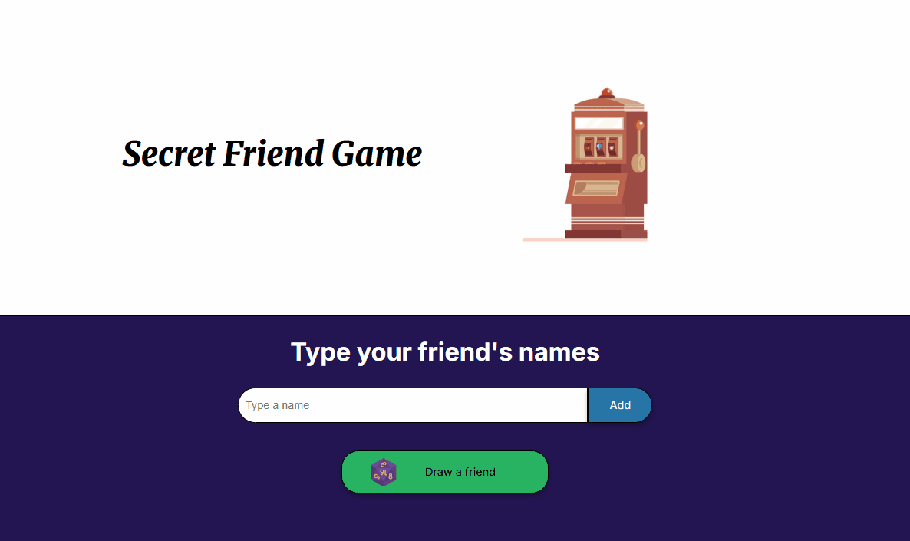

# Secret Friend Game 🎲



A fun and interactive web application that randomly selects a **Secret Friend** from a custom participant list.  
Built with vanilla JavaScript, HTML, and CSS as part of the Oracle Next Education / Alura challenge.

---

## ✨ Features

- Add participants dynamically
- Random secret friend selection
- Responsive and clean interface
- Simple and intuitive user experience

---

## 🚀 Live Demo

🎮 Play here:

👉 https://alehdzb.github.io/Secret_Friend_Challenge/

---

## 🛠️ Technologies Used

- HTML5
- CSS3
- JavaScript (Vanilla JS)

---

## ⚙️ Installation & Usage

1. Clone the repository

```bash
git clone https://github.com/AleHdzB/Secret_Friend_Challenge.git
```

2. Navigate to the project folder

```bash
cd Secret_Friend_Challenge
```

3. Open the project

Open `index.html` in your preferred browser.

---

## 🎯 Learning Objectives

This project was developed to practice and improve skills in:

* JavaScript logic
* DOM manipulation
* Event handling
* Arrays and random selection
* Frontend web development fundamentals

---

## 🌱 Future Improvements

* Prevent duplicate names
* Add dark mode
* Add animations and sound effects
* Save participants using Local Storage
* Improve responsive design for mobile devices

---

## 👨‍💻 Author

Developed by Alejandro Hernández

* GitHub: [https://github.com/AleHdzB](https://github.com/AleHdzB)
* LinkedIn: [https://www.linkedin.com](https://www.linkedin.com)
